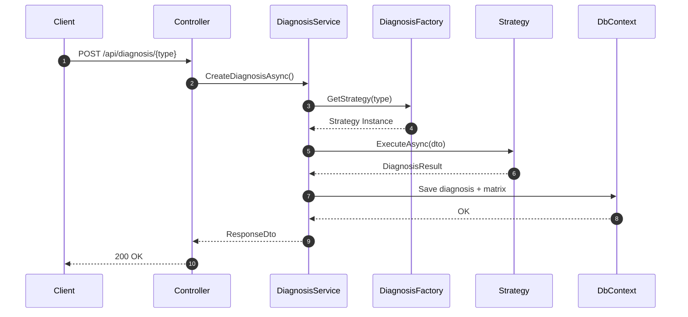
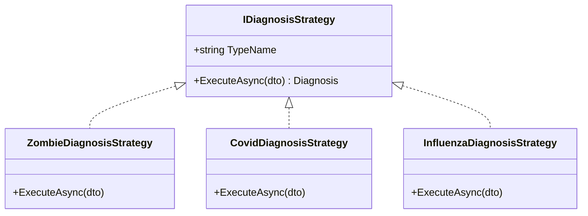

# 🧬 Diagnosis-Api

<div align="center">

### API for Genetic Sequence Detection (Zombie, Covid, Influenza, etc.)


</div>

---

## 🧠 Description

**Diagnosis-Api** is a backend system built in **.NET 8** designed to analyze NxN genetic matrices and determine infection types such as **Zombie**, **Covid**, **Influenza**, and more.

This API demonstrates enterprise‑level backend design principles using:

- **Factory Pattern**
- **Strategy Pattern**
- **Clean Architecture**
- **EF Core without migrations** (manual SQL schema)

> ❗ *The database must be created using SQL scripts included in the repository.*

---

## 🧬 Features

- Detection of genetic infection patterns (horizontal, vertical, diagonal).
- Multiple diagnosis types handled through strategies.
- SQL Server database built via SQL scripts.
- Statistics endpoint (`/api/stats`).
- Swagger enabled (⚠️ **no authentication yet**).
- 100 test patients + sample Zombie matrix preloaded.

---

## 🏗 System Architecture

```
/Domain
   /Entities
/Application
   /DTOs
   /Diagnosis
       /Factory
       /Strategies
       /Services
/Infrastructure
   /Persistence
       ApplicationDbContext.cs
       /EntityConfigurations
/WebApi
   /Controllers
```

---

## 🔁 Sequence Diagram – Diagnosis Workflow



---

## 🧩 Strategy Pattern Diagram



---

## 🧬 Database (No EF Migrations)

The API uses EF Core only as an ORM.  
All tables are created manually:

- `Patient`
- `Diagnosis`

Provided scripts include:

- 100 generated patients
- Example 6×6 Zombie infection matrix

---

## 🚀 How to Run

### 1. Clone the repository
```bash
git clone https://github.com/luisgabrielahumada/TestZombis-Api.git
```

### 2. Configure SQL Server connection
Edit:

```
Env:Local
   appsettings.json
   "ConnectionStrings": {
     "DefaultConnection": "<ConnectionsString>"
   }
   appsettings.Development.json
   "ConnectionStrings": {
     "DefaultConnection": "<ConnectionsString>"
   }
Env:Staging
   appsettings.Staging.json
   "ConnectionStrings": {
     "DefaultConnection": "<ConnectionsString>"
   }
Env:Production
   appsettings.Production.json
   "ConnectionStrings": {
     "DefaultConnection": "<ConnectionsString>"
   }
```

### 3. Run SQL scripts
Create tables + seed data.

### 4. Run the API
```bash
dotnet run
```

### 5. Open Swagger
```
Env:Local
http://localhost:{port}/swagger
Env:Dev-Azure
https://diagnosis-api-dev.azurewebsites.net/swagger
```

> ⚠ *Swagger currently has **no authentication**. In production, secure it with API Keys, JWT, OAuth2 or IP restrictions.*

---

## 📡 Main Endpoints

### 1️⃣ Create Diagnosis

```
POST /api/diagnosis/{diagnosisType} diagnosisType:zombie|covid|ebola|etc
```

#### Example Body
```json
{
  "fullName": "Test Patient 59",
  "patientId": "52BFF1AA-CA68-49A9-AA20-000B8050B581",
  "documentNumber": "DOC00059",
  "geneticCode": [
    "PLAGGP",
    "APGLGP",
    "LLALGL",
    "APLAPL",
    "PPPPLA",
    "LAPLGG"
  ]
}
```

---

### 2️⃣ Statistics Endpoint

```
GET /api/diagnosis/stats?diagnosisType=zombie|covid|ebola|etc
```

#### Example Response
```json
{
  "diagnosisType": zombie|covid|ebola|etc,
  "countInfected": 10,
  "countNotInfected": 35,
  "ratio": 0.22
}
```

---

## 📊 Swagger Usage

Swagger exposes all endpoints, including:

- `POST /api/diagnosis/{diagnosisType}`
- `GET /api/diagnosis/stats`

Because the API is for testing and learning, Swagger currently has **no security**.

To secure later:
- Basic Auth  
- API Key  
- JWT Bearer  
- OAuth2  
- Restrict to local/development  

---

## 🛡 Project Status

- ✔ Fully functional  
- ✔ Clean and maintainable  
- ✔ Built for interviews & technical demos  
- ✔ Extensible: add new diagnosis strategies easily  

---

## 📜 License

Demo & educational project showcasing backend architecture and design patterns.

