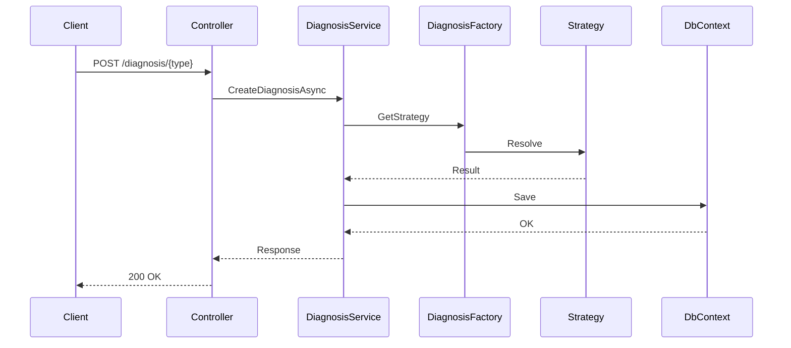
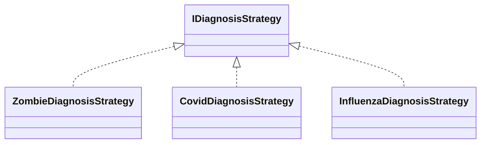

# 🧬 TestZombis-API

<div align="center">

### API for Genetic Sequence Detection (Zombie, Covid, Influenza, etc.)


</div>

## 🧠 Description

**TestZombis-API** is a backend system built in **.NET 8** designed to analyze NxN genetic matrices and determine infection types such as **Zombie**, **Covid**, **Influenza**, and more.

The API implements:

- **Factory Pattern**
- **Strategy Pattern**
- **Clean Architecture**

> ❗ This API does **NOT** use EF migrations. Database must be built using SQL script.

## 🏗 Architecture

```
┌───────────────────────┐
│       Web API          │
└─────────────┬─────────┘
              ▼
┌───────────────────────┐
│      Application       │
└─────────────┬─────────┘
              ▼
┌───────────────────────┐
│       Domain           │
└─────────────┬─────────┘
              ▼
┌───────────────────────┐
│    Infrastructure      │
└───────────────────────┘
```

## 🔁 Sequence Diagram



## 🧩 Strategy Diagram



## 🚀 Run

```
git clone https://github.com/luisgabrielahumada/TestZombis-Api.git
dotnet run
```

## 📡 Endpoint

```
POST /api/diagnosis/{diagnosisType}
```

### Example

```json
{
  "patientFullName": "John Connor",
  "patientDocumentNumber": "DOC55555",
  "patientGender": "Male",
  "diagnosisType": "zombie",
  "geneticCode": [
    "PLAGGP",
    "APGLGP",
    "LLALGL",
    "APLAPL",
    "PPPPLA",
    "LAPLGG"
  ]
}
```

